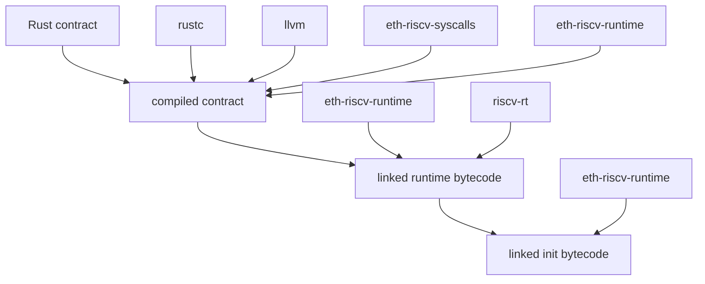
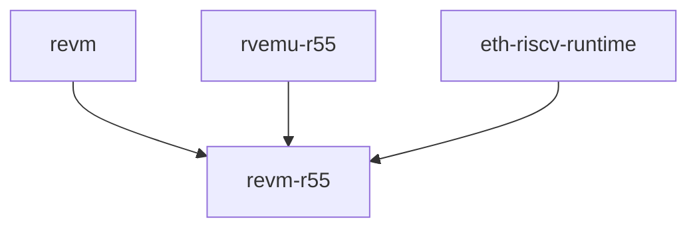

_I'd like to thank Lucas Vella, Georg Wiese and Thibaut Schaeffer for reviewing this post_.

We had a lot of fun last weekend hacking at EthBerlin4. [Rodrigo Saramago](https://github.com/r0qs/) and [Moritz Hoffmann](https://github.com/clonker) from the [Solidity](https://github.com/ethereum/solidity/) team joined [Lucas Vella](https://x.com/lcvella) and [me](https://x.com/leonardoalt/) from [powdr](https://github.com/powdr-labs/powdr) to hack on [R55](https://github.com/leonardoalt/r55). We ended up winning the Infrastructure track and we're quite happy with what we managed to build, so I wanted to share some technical aspects of the project.

This post explains how R55 works and our process for building the PoC in under 40h during the hackathon.

## Relevant links and stats

- [R55](https://github.com/leonardoalt/r55), ~1000 new LoC
- [rvemu-r55](https://github.com/lvella/rvemu), 48 LoC patch
- [revm-r55](https://github.com/r0qs/revm), 241 LoC patch

## Wat

The goal is to take pure Rust code and execute it end-to-end as a smart contract inside an Ethereum execution client. That is, the user must be able to send a normal transaction as if nothing is different, and it just works.

## Plan?

Let's take a step back to understand how things work at the moment in the majority of cases:

1. Developers write smart contracts in Solidity
2. Solidity compiler compiles them to EVM bytecode
3. EVM interpreter executes EVM bytecode
4. Execution client invokes EVM interpreter

We're going to do precisely the same thing:

1. Developers write smart contracts in Rust
2. Rust compiler compiles them to RISCV bytecode
3. RISCV interpreter executes RISCV bytecode
4. Execution client invokes RISCV interpreter

That's it. We knew this before, and we arrived with a clear-ish plan: break the project down in 3 tracks that can be developed in parallel:

- compiler (items 1 and 2)
- interpreter (item 3)
- execution client (item 4)

The separation is quite clear. The compiler and execution client code bases have nothing to do with each other, and the interpreter interfaces with both: (a) it specifies the context in which the compiled bytecode will run, which the compiler needs to know; (b) it actually executes bytecode given by the execution client.

We were quite confident about the compiler and interpreter parts, since Lucas and I are quite familiar with RISCV and pretty much knew exactly what to do. We were less confident about modifying an execution client, and the plan there was to fuck around and find out.

At this point the plan was:

1. Leo compiles Rust code to RISCV, makes that look like Ethereum smart contracts, and follows the interpreter's spec.
2. Lucas takes hand-written RISCV asm, assembles and links it as an ELF binary, and runs that in an interpreter.
3. Rodrigo and Moritz dig into [revm](https://github.com/bluealloy/revm) and find a way to add a new VM that has access to state, without changing the outer facing API.

## Compiler, Runtime & Language

### Rust -> RISCV64

Compiling Rust code to just RISCV assembly is quite simple. Create a new crate `cargo new example --lib` and put this in your code:

```rust
#![no_std]

#[no_mangle]
pub fn main(left: usize, right: usize) -> usize {
    left + right
}
```

We're using `no_std` Rust to simplify everything, and telling the compiler to leave the name of function `main` as is.

Now from the crate's root run:

```sh
export RUSTFLAGS="--emit=asm -g"
cargo +nightly-2024-02-01 build -r --lib -Z build-std=core,alloc --target riscv64imac-unknown-none-elf
```

You might have to install this nightly.
```shell
rustup install nightly-2024-02-01-x86_64-unknown-linux-gnu
```

We told the compiler to also output the assembly files, which we can now inspect. Open file `target/riscv64imac-unknown-none-elf/release/deps/example-<some_hash>.s`. The main part we're interested in is:

```nasm
main:
.Lfunc_begin0:
    .cfi_sections .debug_frame
    .cfi_startproc
    .file   1 "<full_dir>/example" "src/lib.rs"
    .loc    1 5 5 prologue_end
    add a0, a0, a1
```

We've compiled our Rust code into RISCV binary in the form of object files, but now we need to link it into an executable. What does that mean? In short all the libraries used by the program must be combined into a single executable [ELF](https://en.wikipedia.org/wiki/Executable_and_Linkable_Format) file. This executable has to tell its runtime environment (usually the operating system) lots of things, including the address of its code entry point (the usual main function), the address of the stack, heap, read-only memory data, and potentially other sections.

### Linking

An ELF file is structured into a header, sections, and segments:

- Header: Contains metadata about the file, including its type (executable, shared library, or core dump) and architecture (e.g., x86, ARM, RISCV).
- Sections: Contain actual code and data, such as the `.text` section for executable code, `.data` for initialized data, and `.bss` for uninitialized data. There are also sections for symbols, relocation information, and debugging data.
- Segments: Used for loading the binary into memory, typically including a text segment for code and a data segment for data.

The first thing we did was to write a hand-written assembly file, link it, and look inside the executable to make sure we have control over this part. This file is `r55/asm-runtime-example/runtime.s`:

```nasm
	.text
	.globl _start
_start:
	li t0, 0
	la a0, ret_var
	li a1, 8
	ecall # return(ret_var, 8), returns 0x0000000000000005 to the host
	j _start # should be unreachable

	.data
	.align 3
ret_var:
	.dword 5
```

You can compile it with `make`, and inspect the generated executable `runtime`:

```shell
riscv64-unknown-elf-objdump -Cd runtime
```
```nasm
runtime:     file format elf64-littleriscv


Disassembly of section .text:

0000000080300000 <.text>:
    80300000:	00000293          	li	t0,0
    80300004:	00000517          	auipc	a0,0x0
    80300008:	01450513          	addi	a0,a0,20 # 0x80300018
    8030000c:	00800593          	li	a1,8
    80300010:	00000073          	ecall
    80300014:	fedff06f          	j	0x80300000
```

The linker will move memory sections around to conform to the spec defined by the runtime that the executable is supposed to run in, and will provide a map telling where each section is. For that, the linker has to be configured to the specific target via a linker script.

We wrote a minimal linker script `r55/r5-bare-bones.x`, that we could use to link this assembly program, conforming to the addresses expected by the emulator we would be using (more on that later). It also reserves space for the program stack, needed by more complex programs, and the transaction calldata:

```nasm
MEMORY
{
  CALL_DATA : ORIGIN = 0x80000000, LENGTH = 1M
  STACK : ORIGIN = 0x80100000, LENGTH = 2M
  REST_OF_RAM : ORIGIN = 0x80300000, LENGTH = 1021M
}

SECTIONS
{
  . = 0x80300000;
  .text : { *(.text) } > REST_OF_RAM
  .data : {
    *(.data)
    PROVIDE( __global_pointer$ = . + 0x800 );
  } > REST_OF_RAM
  .bss : { *(.bss) } > REST_OF_RAM

  _stack_top = ORIGIN(STACK) + LENGTH(STACK);
}

ENTRY(_start)
```

We know how to control the linker to generate ELF binaries from RISCV assembly, now we need to scale it to RISCV assembly generated from Rust.

Luckily, most of the work is already done by the [riscv-rt](https://crates.io/crates/riscv-rt) library, a minimal RISCV runtime for embedded, bare-metal Rust targets.

The [riscv-rt](https://github.com/rust-embedded/riscv/tree/master/riscv-rt) library provides a basic runtime that wraps Rust code.  It will generate an ELF file whose entry point will be whichever Rust function has the attribute `riscv_rt::entry`, based on its own [`link.x`](https://github.com/rust-embedded/riscv/blob/master/riscv-rt/link.x.in) script, and our extension `r55/r5-rust-r5.x`:

```nasm
/* Pass this linker script alongside with riscv-rt's link.x */

MEMORY
{
  CALL_DATA : ORIGIN = 0x80000000, LENGTH = 1M
  STACK : ORIGIN = 0x80100000, LENGTH = 2M
  REST_OF_RAM : ORIGIN = 0x80300000, LENGTH = 1021M
}

REGION_ALIAS("REGION_TEXT", REST_OF_RAM);
REGION_ALIAS("REGION_RODATA", REST_OF_RAM);
REGION_ALIAS("REGION_DATA", REST_OF_RAM);
REGION_ALIAS("REGION_BSS", REST_OF_RAM);
REGION_ALIAS("REGION_HEAP", REST_OF_RAM);
REGION_ALIAS("REGION_STACK", STACK);

INCLUDE link.x
```

You can already notice here that we made the decision to provide a read-only memory pointer for the Rust code that points to the transaction's calldata at address 0x80000000. This will be handy later when writing a function dispatcher.

For a more advanced example, run the command below inside `r55/erc20`:

```shell
cargo +nightly-2024-02-01 build -r --lib -Z build-std=core,alloc --target riscv64imac-unknown-none-elf --bin runtime
```

The executable `target/riscv64imac-unknown-none-elf/release/runtime` now exists, and is the smart contract's compiled bytecode that will live onchain! It's an executable file and you can try to run it natively, which naturally will not work on your OS. We can, however, inspect it:

```shell
riscv64-unknown-elf-objdump -Cd target/riscv64imac-unknown-none-elf/release/runtime
```

You'll see the following and a lot more:

```nasm
target/riscv64imac-unknown-none-elf/release/runtime:     file format elf64-littleriscv


Disassembly of section .text:

0000000080300000 <_start>:
    80300000:	00000097          	auipc	ra,0x0
    80300004:	0100b083          	ld	ra,16(ra) # 80300010 <_start+0x10>
    80300008:	00008067          	ret
    8030000c:	00000013          	nop
    80300010:	0018                	.2byte	0x18
    80300012:	8030                	.2byte	0x8030
    80300014:	0000                	unimp
	...

0000000080300018 <_abs_start>:
    80300018:	30405073          	.4byte	0x30405073
    8030001c:	34405073          	.4byte	0x34405073
    80300020:	00000093          	li	ra,0
    80300024:	00000113          	li	sp,0
    80300028:	00000193          	li	gp,0
    8030002c:	00000213          	li	tp,0
    80300030:	00000293          	li	t0,0
```

Okay, we can generate bare metal ELF binaries from pure Rust. Now we need to let that Rust code do Ethereum things, and we need to be able to run the binary.

### Ethereum in Rust

Pure Rust smart contract sounds good, but how do I access storage? Or anything else Ethereum related? The RISCV instruction set is prepared for that. It has all the usual instructions for memory access, math, bitwise operations, etc, and most importantly for this context, the `ecall` (environment call) instruction. It is a platform specific runtime instruction, that relies on the interpreter to give semantics to an `ecall`.

We can now define a set of system calls (syscalls) for our Ethereum-RISCV platform. File `r55/eth-riscv-syscalls/src/lib.rs` defines the `Syscall` type with some variants, and the syscall ID they will use.

```rust
syscalls!(
    (0, Return, "return"),
    (1, SLoad, "sload"),
    (2, SStore, "sstore"),
    (3, Call, "call"),
    (4, Revert, "revert"),
);
```

The format we'll use to compile Ethereum syscalls is to set specific registers with the expected information and call `ecall`:

- `t_0`: syscall ID
- `a_0` to `a_7`: arguments, in this order
- `a_0` to `a_7`: return values after the call, in this order

For example, `sstore(42, 1024)` compiles to:

```asm
li t0, 2
li a0, 42
li a1, 1024
ecall
```

We can use this to write Rust functions [implementing the syscalls by using `ecall`](https://github.com/leonardoalt/r55/blob/main/eth-riscv-runtime/src/lib.rs#L56):

```rust
pub fn sstore(key: u64, value: u64) {
    unsafe {
        asm!("ecall", in("a0") key, in("a1") value, in("t0") u32::from(Syscall::SStore));
    }
}
```

By the way, here's an easter egg: before that we did the same thing but to write a test [smart contract in C](https://github.com/leonardoalt/r55/blob/main/c-runtime-examples/sstore-and-sload-example.c):

```cpp
#include "syscalls.h"

void main() {
    sys_sstore(42, 0xdeadbeef);

    uint64_t value = sys_sload(42);
    if (value != 0xdeadbeef) {
        sys_revert();
    }
    sys_return((void*)0, 0);
}
```

### Smart contracts & libraries

Going up the abstraction stack, we can now implement higher level types, such as a [Solidity-like `mapping`](https://github.com/leonardoalt/r55/blob/main/eth-riscv-runtime/src/types.rs):

```rust
impl<K: ToBytes, V: Into<u64> + From<u64>> Mapping<K, V> {
    pub fn encode_key(&self, key: K) -> u64 {
        let key_bytes = key.to_bytes();
        let id_bytes = self.id.to_le_bytes();

        // Concatenate the key bytes and id bytes
        let mut concatenated = Vec::with_capacity(key_bytes.len() + id_bytes.len());
        concatenated.extend_from_slice(&key_bytes);
        concatenated.extend_from_slice(&id_bytes);

        let mut output = [0u8; 32];
        let mut hasher = Keccak::v256();
        hasher.update(&concatenated);
        hasher.finalize(&mut output);

        let mut bytes = [0u8; 8];
        bytes.copy_from_slice(&output[..8]);
        u64::from_le_bytes(bytes)
    }

    pub fn read(&self, key: K) -> V {
        sload(self.encode_key(key)).into()
    }

    pub fn write(&self, key: K, value: V) {
        sstore(self.encode_key(key), value.into());
    }
}
```

The [eth-riscv-runtime](https://github.com/leonardoalt/r55/tree/main/eth-riscv-runtime) also provides an [allocator](https://github.com/leonardoalt/r55/blob/main/eth-riscv-runtime/src/alloc.rs), which adds full support to common Rust types such as `Vec`, `BTreeMap`, `String`, etc.

Finally, we can implement our [ERC20 contract](https://github.com/leonardoalt/r55/blob/main/erc20/src/lib.rs):

```rust
#[derive(Default)]
pub struct ERC20 {
    balance: Mapping<Address, u64>,
}

#[contract]
impl ERC20 {
    pub fn balance_of(&self, owner: Address) -> u64 {
        self.balance.read(owner)
    }

    pub fn transfer(&self, from: Address, to: Address, value: u64) {
        let from_balance = self.balance.read(from);
        let to_balance = self.balance.read(to);

        if from == to || from_balance < value {
            revert();
        }

        self.balance.write(from, from_balance - value);
        self.balance.write(to, to_balance + value);
    }

    pub fn mint(&self, to: Address, value: u64) {
        let to_balance = self.balance.read(to);
        self.balance.write(to, to_balance + value);
    }
}
```

### Runtime & Init bytecode

However, there's an important detail missing: what exactly am I deploying, and how? In Solidity, the `contract` type is built-in the language, and the compiler immediately knows how to generate the runtime bytecode - which contains the [function dispatcher based on function visibility, calldata & ABI decoding](https://docs.soliditylang.org/en/v0.8.26/abi-spec.html#function-selector-and-argument-encoding), etc. The Solidity compiler can also take the `constructor` and built the deployment bytecode, which runs the constructor and copies the runtime bytecode to memory before returning and deploying it. We need to somehow mimic all of that here in order to deploy contracts with minimal changes to revm.

Enter [Rust proc macros](https://doc.rust-lang.org/reference/procedural-macros.html#attribute-macros). We can create a minimal attribute `#[contract]` that when invoked will analyze the given `impl` and automatically derive the function dispatcher with calldata & ABI decoding, constructor and init code, by taking Rust code and creating Rust code. `pub` methods are equivalent to Solidity `public` functions. The macro implementation is a bit long to inline here, but you're welcome to [read it here](https://github.com/leonardoalt/r55/blob/main/contract-derive/src/lib.rs#L15).

We can expand our contract's code to see the effect of the macro:

```shell
cargo +nightly-2024-02-01 expand --lib -Z build-std=core,alloc --target riscv64imac-unknown-none-elf
```

A few important snippets from the output:

```rust
impl Contract for ERC20 {
    fn call(&self) {
        let address: usize = 0x8000_0000;
        ...
        let calldata = unsafe { slice_from_raw_parts(address + 8, length) };
```

This is the hardcoded address where the interpreter injects the calldata. This is quite convenient since we can interpret the pointer as a read-only calldata memory area directly in Rust.

Function dispatcher expansion:

```rust
        let calldata = &calldata[4..];
        match selector {
            0u32 => {
                let (arg0) = <(Address)>::abi_decode(calldata, true).unwrap();
                let result: u64 = self.balance_of(arg0);
                let result_bytes = result.abi_encode();
                let result_size = result_bytes.len() as u64;
                let result_ptr = result_bytes.as_ptr() as u64;
                return_riscv(result_ptr, result_size);
            }
            1u32 => {
                let (arg0, arg1, arg2) = <(
                    Address,
                    Address,
                    u64,
                )>::abi_decode(calldata, true)
                    .unwrap();
                self.transfer(arg0, arg1, arg2);
            }
            2u32 => {
                let (arg0, arg1) = <(Address, u64)>::abi_decode(calldata, true).unwrap();
                self.mint(arg0, arg1);
            }
            _ => revert(),
        }
        return_riscv(0, 0);
```

Note that we didn't implement the function selectors properly using the first 4 bytes of the function signature's hash for simplicity.

One beautiful part of this proc macro is using [Alloy](https://github.com/alloy-rs) and its generic functions to automatically do ABI decoding. For example, for function `pub fn transfer(&self, from: Address, to: Address, value: u64)`, the macro will collect the types `(Address, Address, u64)` in a tuple and call the generic Alloy function `abi_decode` over that type, and that's all we need to do. An analogous process is used for ABI encoding function outputs, as can be seen in the `balance_of` function.

It also creates a `main` function for us that the `riscv_rt` crate can use as entry point whenever the contract is called:

```rust
#[allow(non_snake_case)]
#[export_name = "main"]
pub fn __risc_v_rt__main() -> ! {
    let contract = ERC20::default();
    contract.call();
    eth_riscv_runtime::return_riscv(0, 0)
}
```

The last thing we need is a [deployment binary](https://github.com/leonardoalt/r55/blob/main/erc20/src/deploy.rs). Deploying contracts on Ethereum is kind of funky: the so called [init code](https://docs.soliditylang.org/en/v0.8.26/analysing-compilation-output.html#analysing-the-compiler-output) that runs the constructor is sent as the data of a creation transaction. After the constructor runs, the runtime bytecode that we just compiled above has to be returned as the transaction's output. We can also provide that in simple Rust code:


```rust
#[eth_riscv_runtime::entry]
fn main() -> !
{
    //decode constructor arguments
    //constructor(ars);
    let runtime: &[u8] = include_bytes!("../target/riscv64imac-unknown-none-elf/release/runtime");

    let mut prepended_runtime = Vec::with_capacity(1 + runtime.len());
    prepended_runtime.push(0xff);
    prepended_runtime.extend_from_slice(runtime);

    let prepended_runtime_slice: &[u8] = &prepended_runtime;

    let result_ptr = prepended_runtime_slice.as_ptr() as u64;
    let result_len = prepended_runtime_slice.len() as u64;
    return_riscv(result_ptr, result_len);
}
```

We haven't added full constructor support due to lack of time, but it shouldn't be complicated as a next step.

Notice that this assumes that the runtime bytecode has been compiled.

The last trick we're using here is prefixing all RISCV contracts with the byte `0xff`. This is a quick hack so that the execution client can differentiate between EVM and RISCV bytecode. ELF binaries do use the `0x7f 'ELF'` prefix, but `0x7f` is the EVM opcode `PUSH32` so it could be interpreted as valid EVM code, therefore it's not suitable for this.

To compile the ERC20 example's runtime code, run:

```shell
cargo +nightly-2024-02-01 build -r --lib -Z build-std=core,alloc --target riscv64imac-unknown-none-elf --bin runtime
```

To compile the ERC20 example's runtime code, run:

```shell
cargo +nightly-2024-02-01 build -r --lib -Z build-std=core,alloc --target riscv64imac-unknown-none-elf --bin deploy
```

These are equivalent to Solidity's `--bin-runtime` and `--bin`, respectively.

## RISCV64 Interpreter

In order to run RISCV programs, we need an interpreter. The [rvemu](https://github.com/d0iasm/rvemu) interpreter works well for the RISCV64 base instruction set, of course without any platform specific knowledge, such as our Ethereum syscalls.

We decided to implement the syscalls on the execution client side. [Our fork](https://github.com/lvella/rvemu) of `rvemu` only changes the main interpreter loop to issue an interrupt when a syscall is seen, as opposed to panicking, and it also exposes the memory to the host. Our patch only has 31 additions and 17 deletions and can be seen [here](https://github.com/d0iasm/rvemu/compare/main...lvella:rvemu:main).

## revm + RISCV

Now the part we had no initial idea of how to execute. [revm](https://github.com/bluealloy/revm) is a very clean and organized code base. It is also complex, so we had to take our time to understand where to apply our changes.

After lots of hacking around we settled for adding a new RISCV Emulator (`RVEmu`) into the existing `Interpreter` type, and checking which VM should run when a transaction is executed.

The syscalls are implemented in a [simple match](https://github.com/bluealloy/revm/compare/main...r0qs:revm:main#diff-f9f471ded700a0bcd99351931bfb15df57f54179cb809fc139af76d53c959c2eR405):

```rust
Err(Exception::EnvironmentCallFromMMode) => {
    let t0: u64 = emu.cpu.xregs.read(5);
    match t0 {
        ...
        1 => {
            // Syscall:SLoad
            let key: u64 = emu.cpu.xregs.read(10);
            match host.sload(self.contract.target_address, U256::from(key)) {
                Some((value, is_cold)) => {
                    emu.cpu.xregs.write(10, value.as_limbs()[0]);
                }
                _ => {
                    self.instruction_result = InstructionResult::Revert;
                    break;
                }
            }
        }
        ...
```

If you recall how the syscall `sload` was implemented in Rust, we write 1 to `t_0` (register 5), and write the storage slot in `a_0` (register 10). The host implementation finally gives semantics to the `ecall` RISCV instruction in our platform.

Rodrigo and Moritz did an impressive job here with a [final patch](https://github.com/bluealloy/revm/compare/main...r0qs:revm:main) of only 241 new lines of code on top of `revm`. Also: they had never touched Rust before.

### What about gas?

We decided not to care about gas in this PoC since that would certainly complicate things. I think the gas model here can be quite similar to the EVM: the host functions are the same and can have the same price; math, bitwise & memory opcodes can be similarly priced.

One fun thing we explored for less than an hour was to run the RISCV smart contracts on specialized RISCV64 hardware - which of course Guillaume Ballet had in his backpack - but that's a project in itself and we quickly realized it would be too much. I'd still like to see that happen and we can give some pointers if anyone wants to do it. Anyway, this could also influence gas prices for such smart contracts.

## Putting everything together

Now that we finally have all the parts we need, we can run some transactions. Ideally we would have integrated Foundry as well for deployment and testing, but we ran out of time. [This test](https://github.com/leonardoalt/r55/blob/main/r55/src/main.rs#L224) runs an end-to-end test, using Alloy for ABI encoding:

- Compiles the ERC20 contract's runtime.
- Compiles and links the ERC20 contract's init code.
- Deploys the contract on a memory version of the state.
- Calls `mint(0x0000000000000000000000000000000000000001, 42)` on the deployed contract.
- Calls `balance_of(0x0000000000000000000000000000000000000001)` on the contract, which returns 42.

```shell
Compiling runtime: erc20
Cargo command completed successfully
Compiling deploy: erc20
Cargo command completed successfully
Deployed at addr: 0x522b3294e6d06aa25ad0f1b8891242e335d3b459
Tx result: 0x
Tx result: 0x000000000000000000000000000000000000000000000000000000000000002a
```

## Architecture

The compiler uses `rustc`, `llvm`, [eth-riscv-syscalls](https://github.com/leonardoalt/r55/tree/main/eth-riscv-syscalls), [eth-riscv-runtime](https://github.com/leonardoalt/r55/tree/main/eth-riscv-runtime) and [riscv-rt](https://github.com/rust-embedded/riscv/tree/master/riscv-rt) to compile and link ELF binaries with low-level syscalls to be executed by [rvemu-r55](https://github.com/lvella/rvemu):



The execution environment depends on [revm](https://github.com/bluealloy/revm), and relies on the [rvemu-r55](https://github.com/lvella/rvemu) RISCV interpreter and [eth-riscv-runtime](https://github.com/leonardoalt/r55/tree/main/eth-riscv-runtime).



## Conclusions

We were excited with what we were able to create during the hackathon, and almost couldn't believe it actually worked lol. There was a lot of accurate low level work that could easily have caused any integration to go wrong, and in the end the prototype worked well.

There are probably some parts we omitted due to the length of this post, but feel free to ask questions on Github.

Here are the next things we would have implemented if we had time:

- `CALL` is supported by the client and syscalls, but not yet by the Rust library
- `constructor` is supported by the deployment binary, but not yet by the Rust library
- the compiled RISCV ELF binary is quite large, so it would be good to optimize that due to Ethereum's contract size limit
- Foundry support for deployment
- Examples with native Rust tooling

I'm personally excited about the idea of L2s supporting new VMs and therefore new languages, compilers, and robust existing tooling. Users should be able to use anything, even Python if that's what they want for some reason.

We hope to have shown the feasibility of such project, and hope to soon see such projects in production within the Ethereum L2 ecosystem.

Everyone is welcome to contribute/fork/continue/extend R55! Drop us a message if you're interested in that.
